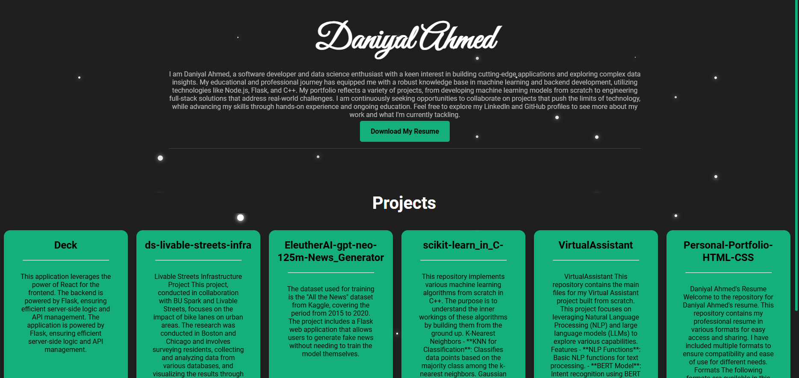

# Personal Portfolio

This is a personal portfolio website for showcasing my projects and resume. The website is built using React for the frontend and Flask for the backend, and it connects to a MongoDB database to fetch project data from my GitHub repositories. Feel free to use this as a template for your own Personal Website 😊

 <!-- DISPLAY=TRUE -->


## Table of Contents

- [Demo](#demo)
- [Features](#features)
- [Technologies Used](#technologies-used)
- [Setup](#setup)
- [Usage](#usage)
- [API Endpoints](#api-endpoints)
- [Screenshots](#screenshots)
- [License](#license)
- [Contact](#contact)

## Demo

You can check out the live demo of the website [here](#).

## Features

- Responsive design for different screen sizes
- Starry background animation
- Fetch and display projects from GitHub repositories
- Download resume functionality
- Modern and clean UI/UX design

## Technologies Used

- **Frontend**: React, HTML, CSS
- **Backend**: Flask, Python
- **Database**: MongoDB
- **Styling**: CSS3
- **API**: GitHub API

## Setup

### Prerequisites

- Node.js and npm installed
- Python and pip installed
- MongoDB database

### Frontend

1. Clone the repository
   ```bash
   git clone https://github.com/DaniyalAhm/personal-portfolio.git
   cd personal-portfolio
   ```
2. Navigate to the frontend directory and install dependencies
   ```bash
   cd frontend
   npm install
   ```
3. Start the React development server
   ```bash
   npm start
   ```

### Backend

1. Navigate to the backend directory
   ```bash
   cd backend
   ```
2. Create a virtual environment and activate it
   ```bash
   python -m venv venv
   source venv/bin/activate  # On Windows, use `venv\Scripts\activate`
   ```
3. Install the required dependencies
   ```bash
   pip install -r requirements.txt
   ```
4. Create a `.env` file in the backend directory and add your environment variables
   ```
   GITHUB_TOKEN=your_github_token
   MONGO_URI=your_mongo_db_uri
   ```
5. Run the Flask server
   ```bash
   python backendmain.py
   ```

## Usage

Once the setup is complete, you can access the website at `http://localhost:3000` (or the port specified by React) and the backend server at `http://localhost:5000`.

## API Endpoints

- **GET /repos**: Fetches the list of repositories from GitHub and updates the MongoDB database.

## Screenshots



## License

This project is licensed under the MIT License. See the [LICENSE](LICENSE) file for details.

## Contact

- LinkedIn: [Daniyal Ahmed](https://www.linkedin.com/in/daniyal-ahmed-435a36280/)
- GitHub: [DaniyalAhm](https://github.com/DaniyalAhm)


# Personal_Portfolio_Static
# Personal_Portfolio_Static
